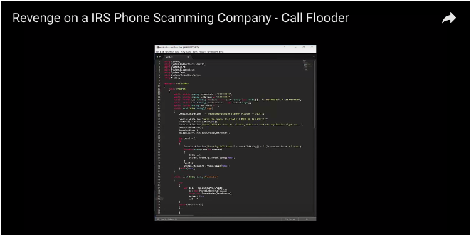

Annoyed by spammers sending you "IRS" phone calls? How about "Problems with your account"?

<br />

Well, I am.
<div class="spacer h25"></div>

There are several approaches to solving this issue.


- Ignore
- Get mad and yell back
- Get duped for the scam
- Report on [https://donotcall.gov](https://donotcall.gov)
- Troll the living daylights out of em

<div class="spacer h25"></div>

I saw the recent video showing a programmer creating a simple python script to flood the spammers with many calls from different numbers to keep their lines busy.

<div class="spacer h25"></div>

If you haven't seen the video put on YouTube by "Project Mayham", check it out, it's pretty awesome. Fun starts about 1:55

<iframe width="660" height="371" src="https://www.youtube.com/embed/EzedMdx6QG4?start=115" frameborder="0" allowfullscreen></iframe>

<br />

I took a screenshot of the code the uploader wrote:

<div class="spacer h25"></div>
You will notice that it is written in python, and is using a popular telophony service for making the calls.
<div class="spacer h25"></div>

As a programmer I thought, well, lets build our own!

<div class="spacer h25"></div>

**WARNING: READ THE TWILIO TOS. This _will_ go against Twilio's [Terms Of Service](https://www.twilio.com/legal/aup).**
<br />
**I _never_ tested this on a phone number that I did not own.**

<div class="spacer h50"></div>

### Build a anti-spam-spam bot in Node.js

<div class="spacer h50"></div>

Here is how the bot works:

- A valid [Twilio](https://www.twilio.com) username/apiKey and purchased phone number is required to use a phone number to call from.
- The bot creates a call using a TwiML response from our server to "create" the spoken words (Twilio Programmable Voice).
- And the bot repeats until all the spammer's phone lines are used up.
<div class="spacer h50"></div>

Step one, head over to [https://twilio.com](https://twilio.com) and get the required telophony items. Refer to [this guide](https://www.twilio.com/docs/quickstart/node/programmable-voice#getting-started) for more info.


<div class="spacer h25"></div>
Alright, lets get started by firing up your favorite editor (neovim) and creating two files, one for our bot (client) and one for the server (I'll get to that shortly).

Our dependencies are minimal, just the [twilio](https://www.npmjs.com/package/twilio) and [express](https://www.npmjs.com/package/express) modules.
<div class="spacer h25"></div>

`package.json`

```json
{
  "dependencies": {
    "express": "^4.15.3",
    "twilio": "^3.4.0"
  }
}
```


### The server.js

We will start with creating the simple server used by twilio for creating the automated voice message.
The server returns a TwiML (variation on XML) to the twilio server for converting into the programmable voice.

<div class="spacer h25"></div>

`server.js`


```js
var express = require('express')

var app = express()
var PORT = 3000

app.post('/call', function (req, res) {
  res.send('<?xml version="1.0" encoding="UTF-8"?><Response><Say>You have been detected for spamming</Say></Response>')
})

console.log('starting on port ', PORT)
app.listen(PORT)

```
<div class="spacer h25"></div>

Run it with: `$ node server.js`

You can either host it on a remote server, or use [ngrok](https://ngrok.com/) to host it on your local system.

```
$ ngrok http 3000

ngrok running...

https://dfdf9034.ngrok.com
```

Copy the URL returned by ngrok for the next step.

<div class="spacer h50"></div>

### The bot.js
<div class="spacer h25"></div>

Our `bot.js` will contain the actual code for creating the calls.

Replace the `accountId` with your twilio account SID, and replace the `accountToken` with your twilio auth token.

<div class="spacer h25"></div>
`bot.js`
```js
var twilio = require('twilio')

var accountId = 'your acount sid here'
var accountToken = 'your account token here'

var client = twilio(accountId, accountToken)
var INTERVAL = 10000 // 10 seconds

var count = 0

var call = function() {
  return client.calls.create({
    url: 'https://<your ngrok random url>ngrok.com/call',
    to: '+<the spammers number>',
    from: '+1<the twilio phone number you purchased>'
  }, function (err, res) {
    if (err) return console.error(err)
    count++
    console.log('number ', count, 'status: ', res.status)
  })
}

call()
setInterval(call, INTERVAL)
```


Save that file and start it with: `$ node bot.js`

The response should be:

```
number  1 status: queued
number  2 status: queued
number  3 status: queued
...
```

Each queued call is then passed to the target which receives the message: "You have been detected for spamming"


Congrats!

<div class="spacer h25"></div>
The complete source code can be found [here](https://github.com/stevelacy/anti-spam-spam-bot)
