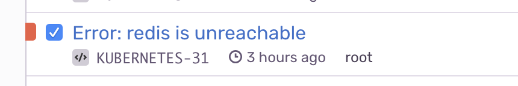

Kubernetes gives many choices for monitoring and service/deployment metrics.
One type of metric that it does not give is the ability to determine if a kubernetes Deployment or Pod is online inside the cluster's network, such as a database only accessible by the cluster's IP.
<br />
<br />

Kubernetes health checks work for kubernetes deployments, but not for external services such as MemoryStore, Redis, or Tile38.

<br />
<br />
Once configured [Kubecat](https://github.com/stevelacy/kubecat) will send error reports to [Sentry.io](https://sentry.io/)

#### Installation


Create a `ConfigMap` with the kubecat config. There are several [core modules](https://github.com/stevelacy/kubecat/blob/master/modules/modules.go) including a generic HTTP module for sending health pings and requests to services.

```yaml
apiVersion: v1
kind: ConfigMap
metadata:
  name: kubecat-config
data:
  kubecat-config.yaml: |
    reporters:
      - name: redis
        module: "Redis"
        interval: 120 # time in seconds
        options:
          url: "redis://redis"
          timeout: 30 # time in seconds
```

Create a `Deployment` to run the kubecat monitor

Replace the `SENTRY_DSN` value with your Sentry DSN

```yaml
apiVersion: extensions/v1beta1
kind: Deployment
metadata:
  name: kubecat
spec:
  template:
    metadata:
      labels:
        app: kubecat
    spec:
      containers:
      - image: "stevelacy/kubecat:latest"
        env:
        - name: SENTRY_DSN
          value: "<Sentry DSN Here>"
          name: kubecat-container
          volumeMounts:
          - name: kubecat-config
            mountPath: /app/config.yaml
            subPath: config.yaml
      volumes:
      - name: kubecat-config
        configMap:
          name: kubecat-config
          items:
          - key: kubecat-config.yaml
            path: config.yaml
```

Kubecat also supports `URL` params from your environment, use the `env:<ENV>` prefix as follows:

```yaml

        env:
        - name: SENTRY_DSN
          value: "Sentry DSN"
        - name: REDIS_URL
          valueFrom:
            secretKeyRef:
              name: env
              key: REDIS_URL
```

And in your kubecat `ConfigMap`:

```yaml
    - name: redis
      module: "Redis"
      interval: 60 # time in seconds
      options:
        url: "env:REDIS_URL"
```

It will mount the `ConfigMap` to the Pod's container with the `volumeMounts`. Any changes to the `ConfigMap` will require the `Deployment` to be updated to point to the new config.

<br />
Once online it will send a health check request to the URL and will alert you when the service is unreachable.
<br />
<br />


