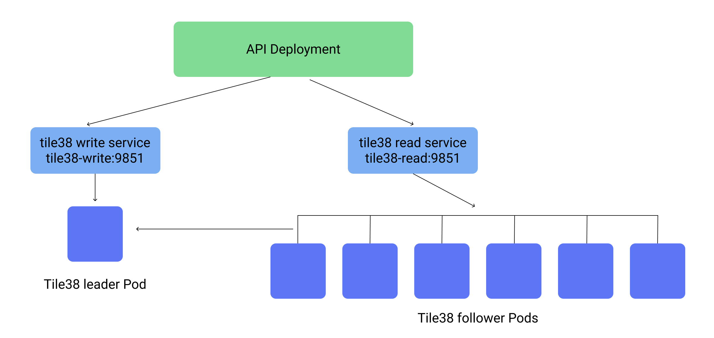

# Scaling Tile38 on Kubernetes

<br />

[Tile38](https://github.com/tidwall/tile38) is a geospatial database written in golang. It is designed to compute gis data with high throughput.

For our system we needed to autoscale Tile38 from 1 instance on kubernetes to 50 or more depending on load and requests.

Since Tile38 uses mostly CPU for calculations, it is easy to add a CPU based horizontal autoscaler on kubernetes to change the number of replicas available.

## leader/follower replication

Tile38 supports basic leader/follower replication. The follower instances run the tile38 command:


`FOLLOW leaderhost 9851`

Where `leaderhost` is the IP or dns hostname of the leader, it will then autosync with the leader's AOF.


For the setup, there will be one leader read/write kubernetes Deployment with a service dedicated to it, and one follower/readonly Deployment with a service for it.

This diagram shows a general overview:




<br />

`tile38.yaml`


```yaml
---
# Tile38 master service
apiVersion: v1
kind: Service
metadata:
  name: tile38-write
  namespace: api
spec:
  type: NodePort
  ports:
    - port: 9851
  selector:
    app: tile38-write

---

```

That service will enable your API deployment to connect to `http://tile38-write:9851` or via tile38's redis adapter, `tile38-write:9851`.

The tile38 leader now needs a deployment of a single read/write Pod. This ensures that you are never writing to two instances that do not sync.

<br />

`tile38.yaml`


```yaml
---
# Tile38 master deployment
apiVersion: extensions/v1beta1
kind: Deployment
metadata:
  name: tile38-write
  namespace: api
spec:
  template:
    metadata:
      labels:
        app: tile38-write
    spec:
      containers:
        - image: "tile38/tile38:alpine"
          name: tile38-write
          ports:
            - containerPort: 9851
              name: tile38-write
---
```

Once complete you can run `kubectl apply -f tile38.yaml` to setup the deployment and service. Verify that you can connect to it inside your cluster.


#### Now for the autoscaling read (follow) instances.


This service and deployment is what will take the brunt of all read requests, at times each pod may be using 100% of it's assigned CPU. For this setup I assigned one full CPU core to each Pod.


<br />

`tile38.yaml`


```yaml
---
# Tile38 read service
apiVersion: v1
kind: Service
metadata:
  name: tile38-read
  namespace: api
spec:
  type: NodePort
  ports:
    - port: 9851
  selector:
    app: tile38-read

---
```

Your instances can now connect to `http://tile38-read:9851` and all the requests will be balanced to all the Pods in the following Deployment:


<br />

`tile38.yaml`


```yaml
---
# Tile38 read
apiVersion: extensions/v1beta1
kind: Deployment
metadata:
  name: tile38-read
  namespace: api
spec:
  replicas: 1 # Initial replica count
  template:
    metadata:
      labels:
        app: tile38-read
    spec:
      containers:
        - image: "stevelacy/tile38:alpine" # Custom image that contains the check.py
          name: tile38-read
          ports:
            - containerPort: 9851
              name: tile38-read
          resources:
            limits:
              cpu: 1
            requests:
              cpu: 1
          imagePullPolicy: Always
          lifecycle:
            postStart:
              exec:
                command: ["python", "/app/check.py"] # This is a custom script to ensure the replica "follows" the leader host
          readinessProbe: # This ensures that this Pod does not show it's state as "ready" until it follows and fully connects to the leader host
            exec:
              command:
                - python
                - /app/check.py
            initialDelaySeconds: 5
            periodSeconds: 5
            timeoutSeconds: 30
            failureThreshold: 5
```

This deployment is using a custom image, [stevelacy/tile38:alpine](https://hub.docker.com/r/stevelacy/tile38/)

That image is using a python script for confirming that the leader is online: [check.py](https://github.com/stevelacy/tile38-kubernetes-readiness)

<br />
> Note: it checks to see that the leader tile38 instance has 10 or more boundaries in it's system. If you wish to have fewer than 10 boundaries please modify as needed.


#### Autoscaling

The core kubernetes autoscaler does a decent job of monitoring the cpu levels of the Pods and changing the requested replica counts as needed.


This autoscaling config will ensure that the replicas will start at 1 and scale up to a max of 10 when the average cpu crosses over 80%.

When the cpu load drops below 80% it will slowly start removing the excess replicas until it achieves constant 80% load or just one remaining replica.

<br />


`tile38.yaml`


```yaml
---

# Autoscale pods based on cpu usage

apiVersion: autoscaling/v2beta1
kind: HorizontalPodAutoscaler
metadata:
  name: tile38-autoscaler
  namespace: api
spec:
  scaleTargetRef:
    apiVersion: apps/v1beta1
    kind: Deployment
    name: tile38-read
  minReplicas: 1
  maxReplicas: 10
  metrics:
    - type: Resource
      resource:
        name: cpu
        targetAverageUtilization: 80

```


Deploy the entire tile38 config with `kubectl apply -f ./tile38.yaml`

<br />
Verify with `kubectl get deployment --namespace api` to confirm that the correct number of instances are created.

```shell
$ kubectl get deployment --namespace api
NAME                        DESIRED   CURRENT   UP-TO-DATE   AVAILABLE   AGE
tile38-write                1         1         1            1           21m
tile38-read                 3         3         3            3           21m

```


You can also send a curl request from inside the cluster to the master and read instances to get their `server` information.

```shell
$ curl tile38-read:9851/server
{"ok":true,"stats":{"aof_size":6807927,"avg_item_size":126,"cpus":8,"heap_released":0,"heap_size":37048872,"http_transport":true,"id":"30b9d6ddfda2d30018503ebg49e79a21","in_memory_size":7012733,"max_heap_size":0,"mem_alloc":37048872,"num_collections":1,"num_hooks":0,"num_objects":25,"num_points":292169,"num_strings":0,"pid":38461,"pointer_size":8,"read_only":false,"threads":8},"elapsed":"1.738714ms"}
```

<br />

You can confirm that the autoscaling is working by submitting high traffic to the instances and checking with `kubectl`


```shell
$ kubectl get deployment --namespace api
NAME                        DESIRED   CURRENT   UP-TO-DATE   AVAILABLE   AGE
tile38-write                1         1         1            1           45m
tile38-read                 10        6         6            6           45m

```
